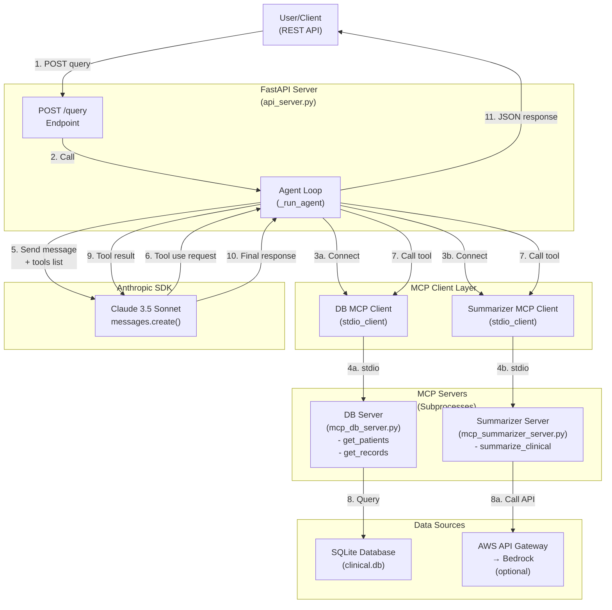

# MCP Architecture Diagram

## Data Flow

1. **User Request** → FastAPI receives query via REST
2. **Agent Initialization** → Creates MCP client connections to both servers
3. **Tool Discovery** → Gets list of available tools from each MCP server
4. **Claude Loop** → Sends query + tools to Claude API
5. **Tool Calls** → Claude requests tool execution
6. **Tool Execution** → Agent calls appropriate MCP server
7. **Results** → MCP servers return data (from DB or Bedrock)
8. **Response Loop** → Results sent back to Claude
9. **Final Answer** → Claude returns text response to user

## Key Components

- **api_server.py**: FastAPI server, orchestrates MCP connections
- **mcp_db_server.py**: Exposes database tools via MCP
- **mcp_summarizer_server.py**: Exposes summarization tools via MCP
- **stdio transport**: Lightweight communication between processes
- **ClientSession**: Manages MCP protocol handshake & messaging
