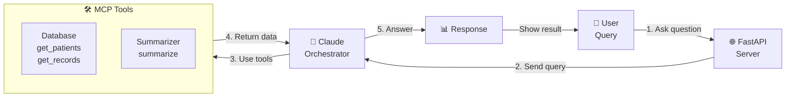

# Simple MCP Architecture - Demo View

## Flow 

1. **User asks a question** via REST API
2. **Claude receives the query** and sees what tools are available
3. **Claude decides which tools to use** (database or summarizer)
4. **Tools execute and return results**
5. **Claude synthesizes the answer** and returns it to the user

That's it! MCP (Model Context Protocol) is just a way for Claude to safely call external tools.
